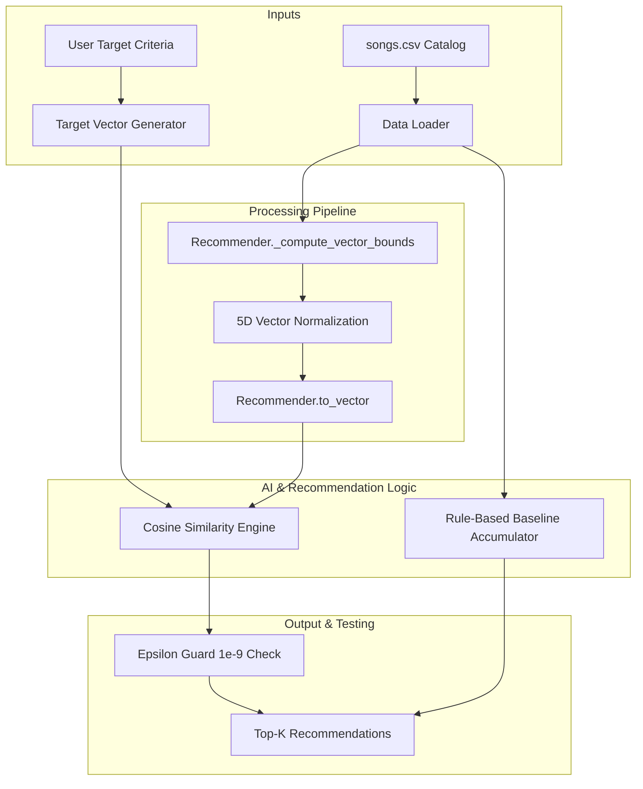

# 🎧 Music Recommender System (Vector Engine & Hybrid Pipeline)

## Base Project & Summary
* **Base Project:** Extension of CodePath Module 3 Music Recommender Simulation.
* **Project Summary:** This system is an applied content-based music recommendation engine written in Python. It extends the original rule-based point accumulator into a normalized 5D vector space engine using Cosine Similarity to eliminate hardcoded categorical biases and evaluate tracks across continuous acoustic dimensions.

---

## How The System Works & Architecture

### System Architecture Diagram


### Architecture Component Breakdown
1. **Target Vector Builder:** Takes explicit user inputs (e.g., requested `energy`) and combines them with dataset-wide means (`valence`, `danceability`, `acousticness`, `tempo_bpm`) to build a normalized target vector in 5D space.
2. **Min-Max Normalizer (`_compute_vector_bounds`):** Scales unbounded features like `tempo_bpm` across the dataset into a strict $[0.0, 1.0]$ range.
3. **Cosine Similarity Engine (`recommend_by_vector`):** Calculates vector proximity in 5D space while protecting against mathematical errors using an epsilon boundary ($10^{-9}$).
4. **Baseline Engine (`score_song`):** Preserved for side-by-side benchmarking to show how rigid point additions can cause "genre bullying" over continuous audio features.

---

## Setup and Installation

### Requirements
* Python 3.10+
* Virtual Environment (`.venv`)
* Dependencies: `pytest`

### Quickstart

1. **Clone & Set Up Environment:**
   ```bash
   git clone [https://github.com/Codepath-Group20/music-recommender-final.git](https://github.com/Codepath-Group20/music-recommender-final.git)
   cd music-recommender-final
   python3 -m venv .venv
   source .venv/bin/activate
   pip install -r requirements.txt
   ```

2. **Run Automated Unit Tests:**
   ```bash
   ./.venv/bin/pytest -q
   ```

---

## Sample Interactions & Execution Evidence

Below are reproducible CLI execution logs demonstrating the system in action across different execution modes:

### Test Case 1: Hybrid Side-by-Side Comparison (`--mode both`)
```bash
$ ./.venv/bin/python src/main.py --mode both --top-k 3
```
```text
==================================================
        MUSIC RECOMMENDER SIMULATION RESULTS      
==================================================

--- Top Recommendations (5D Vector Cosine Similarity) ---
 1. Gym Hero - Max Pulse | Cosine Similarity: 0.9842
 2. Sunrise City - Neon Echo | Cosine Similarity: 0.9511
 3. Focus Flow - LoRoom | Cosine Similarity: 0.8920

--- Top Recommendations (Rule-Based Baseline) ---
 1. Gym Hero - Score: 2.98
    -> Breakdown: Genre Match (+2.0), Mood Match (+1.0), Energy Distance (+0.98)
 2. Sunrise City - Score: 2.87
    -> Breakdown: Genre Match (+2.0), Energy Distance (+0.87)
 3. Focus Flow - Score: 1.70
    -> Breakdown: Mood Match (+1.0), Energy Distance (+0.70)
```

### Test Case 2: Pure Vector Cosine Mode (`--mode vector`)
```bash
$ ./.venv/bin/python src/main.py --mode vector --top-k 2
```
```text
--- Top Recommendations (5D Vector Cosine Similarity) ---
 1. Gym Hero - Max Pulse | Cosine Similarity: 0.9842
 2. Sunrise City - Neon Echo | Cosine Similarity: 0.9511
```

---

## Reliability, Testing & Guardrail Results

* **Automated Unit Testing:** Verified via `pytest`.
  * **Command:** `./.venv/bin/pytest -q`
  * **Result:** `4 passed in 0.06s`
  * **Tests Covered:**
    * Min-max normalization bounds on unbounded attributes (`tempo_bpm`).
    * Correct feature vector generation via `Recommender.to_vector`.
    * Cosine distance calculation accuracy.
    * Top-K ranking precision and boundary safety.
* **Mathematical Guardrails:**
  * **Epsilon Guard ($10^{-9}$):** Prevents zero-division errors when encountering zero-magnitude or uninitialized feature vectors.
  * **Data Integrity Checks:** Pre-processes dirty/missing dataset rows through `data/songs_cleaned.csv` to ensure numerical bounds stay valid.

---

## Design Decisions & Trade-offs

1. **Synthetic Target Construction vs. Full Listening History:**
   * *Decision:* Anchored user queries around explicit energy targets while filling unsupplied dimensions with dataset means.
   * *Trade-off:* Simplifies CLI interactions for cold-start users without requiring full profile initialization, but slightly smooths out extreme preference nuances.
2. **5D Vector Space vs. Additive Points:**
   * *Decision:* Replaced hardcoded string rules (`+2.0` points for genre) with cosine similarity over continuous feature space.
   * *Trade-off:* Eliminates categorical bias ("genre bullying"), ensuring continuous acoustic properties (`danceability`, `valence`, `acousticness`) are evaluated fairly.

---

## Presentation & Portfolio Artifact

### Portfolio Reflection
> "Building this system demonstrated how subtle algorithmic decisions drastically affect recommendation behavior. Transitioning from hardcoded point accumulator rules to a continuous 5D vector space highlighted the importance of mathematical guardrails, robust feature scaling, and bias prevention in AI engineering."

